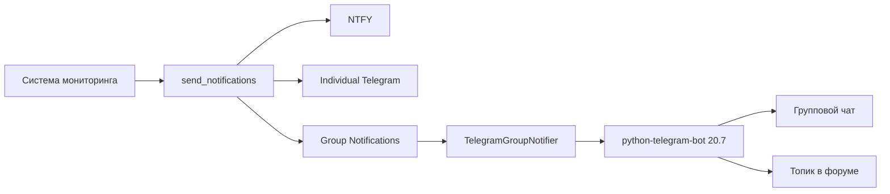

# Групповые уведомления Telegram

Система поддерживает отправку уведомлений в групповые чаты Telegram с использованием библиотеки `python-telegram-bot==20.7`.

## 🚀 Быстрый старт

### 1. Настройка бота

1. Создайте бота через [@BotFather](https://t.me/BotFather)
2. Получите токен бота
3. Добавьте бота в группу как администратора с правами на отправку сообщений

### 2. Получение ID группы

Для получения отрицательного ID группы:

1. Добавьте бота [@userinfobot](https://t.me/userinfobot) в группу
2. Отправьте команду `/start`
3. Бот покажет информацию о группе, включая ID
4. ID группы должен быть отрицательным (например, `-1003075012272`)

### 3. Получение ID топика (для форумных групп)

Если группа настроена как форум:

1. Откройте нужный топик
2. Скопируйте ссылку на топик
3. ID топика - это число после `_` в ссылке
   - Пример: `https://t.me/c/1003075012272/1` → ID топика: `1`

## ⚙️ Конфигурация

### Переменные окружения

Добавьте в файл `.env`:

```env
# Основные настройки бота
TELEGRAM_BOT_TOKEN=8423537642:AAH4pSV9jblUNsH_uM-0XPppzHtQQ12e9nc

# Групповые уведомления
TELEGRAM_GROUP_ENABLED=True
TELEGRAM_GROUP_CHAT_ID=-1003075012272
TELEGRAM_GROUP_THREAD_ID=1
```

### Параметры

| Параметр | Описание | Обязательный | Пример |
|----------|----------|--------------|--------|
| `TELEGRAM_BOT_TOKEN` | Токен бота от @BotFather | ✅ | `8423537642:AAH...` |
| `TELEGRAM_GROUP_ENABLED` | Включить групповые уведомления | ✅ | `True` |
| `TELEGRAM_GROUP_CHAT_ID` | ID группового чата (отрицательный) | ✅ | `-1003075012272` |
| `TELEGRAM_GROUP_THREAD_ID` | ID топика для форумных групп | ❌ | `1` |

## 📋 Архитектура



### Компоненты

1. **`group_notifications.py`** - новый модуль с классом `TelegramGroupNotifier`
2. **`notifications.py`** - обновлен с поддержкой групповых уведомлений
3. **`config.py`** - добавлены настройки для групповых уведомлений

## 🔧 API

### Класс TelegramGroupNotifier

```python
from app.core.group_notifications import TelegramGroupNotifier

# Инициализация
notifier = TelegramGroupNotifier(
    bot_token="YOUR_BOT_TOKEN",
    chat_id="-1003075012272",
    thread_id="1"  # опционально
)

# Отправка сообщения
success = notifier.send_message("Тестовое сообщение")

# Тест соединения
is_connected = notifier.test_connection()
```

### Функция send_group_notification

```python
from app.core.group_notifications import send_group_notification

success = send_group_notification(
    bot_token="YOUR_BOT_TOKEN",
    chat_id="-1003075012272",
    message="Сообщение об ошибке",
    endpoint_url="https://api.example.com/health",
    thread_id="1"  # опционально
)
```

## 📨 Форматирование сообщений

Групповые уведомления автоматически форматируются с:

- 🔔 Эмодзи индикатором
- **Жирным заголовком**
- HTML разметкой
- Ссылкой на эндпоинт

### Пример сообщения

```
🔔 Групповое уведомление мониторинга

❌ Эндпоинт https://api.example.com/health недоступен
Статус: 500 Internal Server Error
Время: 2024-12-12 12:25:43 UTC

🔗 https://api.example.com/health
```

## 🚦 Интеграция с существующей системой

Групповые уведомления автоматически интегрированы в функцию `send_notifications()`:

```python
# Автоматически отправляет во все настроенные каналы:
# - NTFY (если включен)
# - Individual Telegram (если включен)
# - Group Telegram (если включен)

from app.core.notifications import send_notifications

send_notifications(
    message="Эндпоинт недоступен",
    endpoint_url="https://api.example.com/health",
    endpoint_id=1
)
```

## 🔍 Логирование

Система логирует:

- ✅ Успешную отправку сообщений
- ❌ Ошибки при отправке
- 📊 Статус всех каналов уведомлений

### Пример логов

```
INFO:app.core.group_notifications:Group notification sent to chat_id -1003075012272 (thread 1): 🔔 Групповое уведомление мониторинга...
INFO:app.core.notifications:Notification dispatch complete: NTFY: ✓ | Telegram: ✓ | Group: ✓
```

## 🛠️ Устранение неполадок

### Бот не может отправить сообщение

1. **Проверьте права бота:**
   - Бот добавлен в группу?
   - У бота есть права на отправку сообщений?

2. **Проверьте конфигурацию:**
   - `TELEGRAM_GROUP_CHAT_ID` отрицательный?
   - `TELEGRAM_BOT_TOKEN` корректный?

3. **Проверьте топик:**
   - Топик существует?
   - ID топика корректный?

### Тестирование соединения

```python
from app.core.group_notifications import TelegramGroupNotifier

notifier = TelegramGroupNotifier(
    bot_token="YOUR_BOT_TOKEN",
    chat_id="-1003075012272"
)

if notifier.test_connection():
    print("✅ Соединение успешно!")
else:
    print("❌ Ошибка соединения")
```

### Типичные ошибки

| Ошибка | Причина | Решение |
|--------|---------|---------|
| `Chat not found` | Неверный ID чата | Проверьте ID группы |
| `Bot was blocked` | Бот заблокирован | Разблокируйте бота в группе |
| `Topic not found` | Неверный ID топика | Проверьте ID топика |
| `Forbidden` | Нет прав | Дайте боту права администратора |

## 📱 Примеры использования

### Базовая настройка

```env
TELEGRAM_BOT_TOKEN=8423537642:AAH4pSV9jblUNsH_uM-0XPppzHtQQ12e9nc
TELEGRAM_GROUP_ENABLED=True
TELEGRAM_GROUP_CHAT_ID=-1003075012272
```

### Форумная группа с топиком

```env
TELEGRAM_BOT_TOKEN=8423537642:AAH4pSV9jblUNsH_uM-0XPppzHtQQ12e9nc
TELEGRAM_GROUP_ENABLED=True
TELEGRAM_GROUP_CHAT_ID=-1003075012272
TELEGRAM_GROUP_THREAD_ID=1
```

### Отключение групповых уведомлений

```env
TELEGRAM_GROUP_ENABLED=False
```

## 🔗 Дополнительные ресурсы

- [python-telegram-bot документация](https://docs.python-telegram-bot.org/)
- [Telegram Bot API](https://core.telegram.org/bots/api)
- [@BotFather](https://t.me/BotFather) - создание ботов
- [@userinfobot](https://t.me/userinfobot) - получение ID чатов